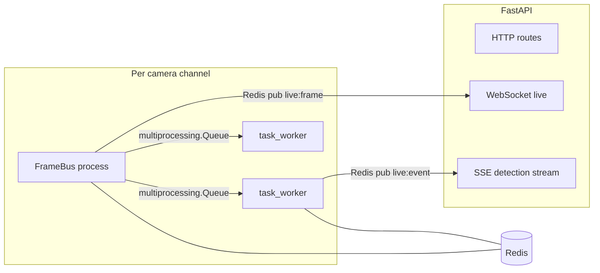

# Pipeline architecture and environment

## Process model

The stack is a **single FastAPI (uvicorn) process** plus **multiprocessing** workers—not separate microservices.



| Component | Module | Role |
|-----------|--------|------|
| **Inference + tracking** | [`frame_bus.py`](../frame_bus.py) | RTSP/video ingest, resize, **YOLO + BoT-SORT**, fan-out to task queues, optional **live JPEG** to Redis, optional **disk** frames under `OUTPUT_DIR`. |
| **Task algorithms** | [`task_worker.py`](../task_worker.py), [`services/`](../services/) | Cross-line, PPE, phone, face, cashier, etc. Consume **pre-detected** `Detection` list; no second YOLO run. |
| **Embeddings** | [`embedding_worker.py`](../embedding_worker.py) | Batched ReID / semantic embeddings → Qdrant (optional). |
| **API / streaming** | [`app.py`](../app.py), [`apis/`](../apis/) | REST, WebSockets ([`apis/ws_live.py`](../apis/ws_live.py)), SSE ([`apis/detection_stream.py`](../apis/detection_stream.py)). |

**Legacy path:** [`pipeline.py`](../pipeline.py) `CameraPipeline` chains `REGISTRY` services; production detection uses **FrameBus + task workers** ([`apis/detection.py`](../apis/detection.py)).

## Frame and detection flow

1. **`stream.frames()`** yields BGR frames (RTSP or file).
2. **FrameBus** resizes to `WIDTH` × `HEIGHT` (height `0` = keep aspect).
3. **JPEG encode #1** → `frame_b64` for task payloads (`TASK_QUEUE_JPEG_QUALITY`, default 85).
4. **`model.track()`** → tracked boxes → list of **`Detection`** objects (`services/detector.py`).
5. **Annotation** for live/disk only (`LIVE_ANNOTATION_MODE`: `opencv` | `ultralytics` | `none`).
6. **Live publish** (every Nth frame): JPEG to Redis `live:frame:{camera_id}` (`LIVE_JPEG_QUALITY`, default 75). When there are no drawn overlays and qualities match, the task JPEG buffer may be **reused** to avoid a second encode.
7. **Tasks** receive the **pre-annotation** `frame_b64` plus `detection.items`.

There is **no duplicate inference** on the hot path: one YOLO+tracker run per frame per camera.

## Annotation vs “missing boxes”

Bounding boxes on the **live WebSocket** come only from **FrameBus** (`_annotate_for_stream`). Common reasons they are missing:

- `LIVE_ANNOTATION_MODE=none`
- **Redis unavailable** and **`SAVE_OUTPUT=false`**: `need_draw` is false on non-publish frames, so no overlay is produced for those frames.
- **`LIVE_ANNOTATION_MODE=opencv`** and **zero detections** for that frame (expected: clean frame).

Diagnostics: **`GET /stream/debug/annotation-state`** and logs from FrameBus (`ANNOTATION_DEBUG_LOG_INTERVAL`, `FRAMEBUS_NEED_DRAW_WARN_SEC`).

## Storage and cleanup

| Env | Default | Purpose |
|-----|---------|---------|
| `SAVE_OUTPUT` | `false` | If true, writes every annotated frame under `OUTPUT_DIR/{camera_id}/`. |
| `OUTPUT_DIR` | `./outputs` | FrameBus disk output root. |
| `SAVE_FORMAT` | `jpg` | `jpg` or `webp` for `vision_utils.save_frame`. |
| `SAVE_JPEG_QUALITY` | `80` | JPEG quality for disk saves. |
| `SAVE_WEBP_QUALITY` | `80` | WebP quality when `SAVE_FORMAT=webp`. |
| `OUTPUT_RETENTION_HOURS` | `24` | TTL for background file sweeper (`0` = disable). |
| `STORAGE_CLEANUP_INTERVAL_SEC` | `3600` | Sweep interval. |

Evidence images (capture/scene) still use task-defined paths (mostly `.jpg`); the sweeper walks `CAPTURE_DIR`, `SCENE_DIR`, `GALLERY_DIR`, `CASHIER_EVIDENCE_DIR`, `CAMERA_SNAPSHOT_DIR`, and `OUTPUT_DIR`.

## Performance-related environment

| Env | Default | Purpose |
|-----|---------|---------|
| `TASK_QUEUE_JPEG_QUALITY` | `85` | Quality for `frame_b64` in task payloads. |
| `LIVE_JPEG_QUALITY` | `75` | Quality for Redis live frames. |
| `STATE_UPDATE_INTERVAL` | `10` | Min frames between `shared_state` Manager writes. |
| `STATE_UPDATE_MIN_SEC` | `1.0` | Min seconds between `shared_state` writes. |
| `PERF_LOG_INTERVAL` | `300` | Log YOLO/encode/publish timing every N frames. |
| `LIVE_ANNOTATION_MODE` | `opencv` (code default; Compose may override) | `opencv` is lighter than `ultralytics` `plot()`. |
| `ANNOTATION_THREADS` | `0` | If &gt; 0, annotate+encode+publish run in a thread pool; inference loop stays sync. |
| `DYNAMIC_FRAME_SKIP` | `false` | Increase skip-N when task queues are near full. |
| `LIVE_PUBLISH_REQUIRE_SUBSCRIBER` | `false` | Skip Redis `live:frame:*` publish when subscriber count is 0. |
| `MODEL_WARMUP_FRAMES` | `5` | Warm-up inferences after YOLO load (TensorRT first-frame spike). |
| `MIN_DETECTION_AREA_PX` | `0` | Filter small boxes before task fan-out. |
| `BBOX_SMOOTHING_ALPHA` | `0` | EMA smoothing on annotation boxes only (not task logic). |
| `TASK_SHM_ENABLED` | `false` | Fan-out `FrameRef` via shared memory instead of pickled JPEG. |
| `TRACKER_STATE_RESTORE` | `false` | JSON checkpoint of last track bboxes on stop/startup. |
| `CUDA_PREPROCESS` | `false` | Try `cv2.cuda.resize` before CPU resize. |
| `CPU_AFFINITY_ENABLED` | `false` | Pin FrameBus process to cores (`CAMERA_CPU_AFFINITY`). |
| `WS_MUX_ENABLED` | `false` | One Redis pubsub per camera for WebSocket live clients. |

Full list: [`OPTIMIZATION_REFERENCE.md`](./OPTIMIZATION_REFERENCE.md).

## Task worker and SSE delivery

- **`task_worker.py`**: optional `XADD` to `live:events:{camera_id}` when `REDIS_STREAMS_ENABLED=true` (Pub/Sub unchanged).
- **`apis/detection_stream.py`**: `replay_after()` (in-memory ring) and `replay_after_stream()` (Redis Streams) for `Last-Event-ID` on `GET /detection/stream`.
- **`task_worker.py`**: honors `detailConfig.confThreshold` when filtering detection items (M-4).

## Worker process lifecycle and zombie prevention

When a FrameBus process exits naturally (e.g. a local video file is exhausted), its OS process entry remains until the parent calls `waitpid()`.  Without explicit cleanup this produces a **zombie process**.

`DetectionResource._reap_finished_processes()` is called at the start of every `_start()` and `_stop()` call.  It iterates `_bus_processes` and `_task_processes` and calls `proc.join(timeout=0)` on any process whose `exitcode is not None` (i.e. it has already exited).  This is sufficient to reap all naturally-finished workers before the next API operation.

The optional `WATCHDOG_ENABLED=true` path also handles unexpected crashes by detecting dead processes via `is_alive()` and calling `_restart_channel()`, but it is disabled by default to avoid unintentional respawns on edge devices.

## RTSP transport override API

`utils/rtsp_ffmpeg` exposes a small runtime API for per-camera RTSP transport selection:

```python
from utils.rtsp_ffmpeg import set_rtsp_transport, get_rtsp_transport, clear_rtsp_transport_overrides

# Override transport for one camera (e.g. UDP on low-latency LAN)
set_rtsp_transport("cam1", "udp")

# Read effective transport (falls back to RTSP_TRANSPORT env → "tcp")
get_rtsp_transport("cam1")   # → "udp"
get_rtsp_transport("cam2")   # → "tcp" (global default)

# Remove all per-camera overrides (e.g. after a watchdog restart)
clear_rtsp_transport_overrides()
```

`build_rtsp_ffmpeg_options(camera_id=None)` picks up the override automatically.  The global default is set by the `RTSP_TRANSPORT` env var (default `"tcp"`).

## Stream ingest backend

`stream.media_pts_ingest_enabled()` returns `True` when `STREAM_INGEST` is set to `"pyav"` or `"av"`.  The PyAV backend availability can be probed at import time via `utils.stream_pyav.pyav_available()` — safe to call even when the `av` package is not installed.

## WebSocket camera-ID validation

`apis.ws_live.validate_camera_id(camera_id)` returns `None` for valid IDs and a human-readable rejection reason string for:
- reserved JavaScript sentinels: `"null"`, `"undefined"`, `"none"`, `"nan"`
- IDs containing characters outside `[A-Za-z0-9_\-]`

## Related endpoints

- `GET /stream/metrics` — per-camera stats from shared state.
- `GET /stream/health` — same data wrapped under `{"cameras": [...]}`.
- `GET /stream/resilience-stats` — reconnect counts, circuit-breaker state, DLQ size.
- `GET /stream/debug/annotation-state` — annotation + Redis publish diagnostics.
- `GET /detection/status` — camera status (Pydantic `CameraStatus` ignores unknown extra keys; optional annotation fields are declared in [`schemas.py`](../schemas.py)).

## End-to-end validation test

`tests/e2e/test_final_system_validation.py` spins up a real `uvicorn` process, registers a camera pointing at `artifacts/crossline_jabal_live_test/clip_15s.mp4`, and exercises the full pipeline without any external infrastructure (no Redis, no Docker):

| Test class | What it checks |
|---|---|
| `TestServerLifecycle` | `/health`, OpenAPI schema, all required routes present |
| `TestCameraAndTaskRegistration` | Camera + `CROSS_LINE` task idempotent registration |
| `TestDetectionLifecycle` | Start → running state, metrics populated, frame count advancing, annotation state, drop rate < 20%, queue drop rate < 10% |
| `TestPersistenceAndArtifacts` | Output JPEG frames saved and decodable, events dir created, JSONL schema valid |
| `TestMemoryAndResourceStability` | RSS growth < 300 MB / 10 s, no zombie processes after reap, CPU < 250% |
| `TestStartStopCycles` | 3× stop→start churn, worker cleanup after stop |
| `TestCleanShutdown` | Graceful stop before teardown, artifact dirs non-empty, resilience stats reachable |

Run with:
```bash
DEVICE=cpu LIVE_ANNOTATION_MODE=opencv SAVE_OUTPUT=true \
  pytest tests/e2e/test_final_system_validation.py -v --timeout=300
```
